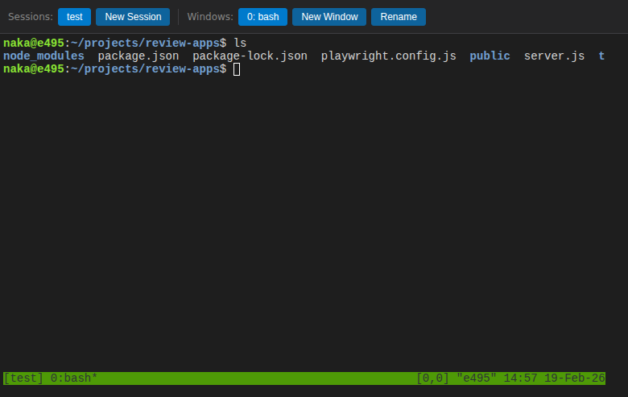

# tmux Web Terminal

ブラウザから tmux セッションを操作できる Web アプリ。



## 機能

- ブラウザ上でリアルタイムターミナル操作 (xterm.js)
- tmux セッション・ウィンドウの作成 / 切替 / リネーム / 削除
- セッションが存在しない場合は自動で `main` セッションを作成
- 2秒ポーリングによるナビバー自動更新

## 技術スタック

| 役割 | 技術 |
|------|------|
| Backend | Node.js + Express + ws + node-pty |
| Frontend | Vanilla JS + xterm.js 5.3 |
| Test | Playwright |

## セットアップ

```bash
# 依存パッケージのインストール
npm install

# サーバ起動
npm start
# → http://localhost:3000
```

tmux がインストールされている必要があります。

```bash
# Ubuntu/Debian
sudo apt install tmux

# macOS
brew install tmux
```

## REST API

| Method | Path | 説明 |
|--------|------|------|
| GET | `/api/sessions` | セッション一覧 |
| POST | `/api/sessions` | セッション作成 `{name}` |
| DELETE | `/api/sessions/:session` | セッション削除 |
| PUT | `/api/sessions/:session/name` | セッションリネーム `{name}` |
| GET | `/api/sessions/:session/windows` | ウィンドウ一覧 |
| POST | `/api/sessions/:session/windows` | ウィンドウ作成 `{name?}` |
| DELETE | `/api/sessions/:session/windows/:window` | ウィンドウ削除 |
| PUT | `/api/sessions/:session/windows/:window/name` | ウィンドウリネーム `{name}` |

## WebSocket プロトコル

**Client → Server**

```json
{"type": "attach", "session": "main", "window": "0", "cols": 220, "rows": 50}
{"type": "input", "data": "ls\n"}
{"type": "resize", "cols": 220, "rows": 50}
```

**Server → Client**

```json
{"type": "output", "data": "...terminal output..."}
{"type": "error", "message": "..."}
```

## テスト

```bash
npx playwright test
```

| テスト | 内容 |
|--------|------|
| 1 | ページロード — ナビバーとターミナルが表示される |
| 2 | セッション作成 — ナビバーに追加される |
| 3 | ウィンドウ作成 — ナビバーに追加される |
| 4 | セッションリネーム — タブ名が更新される |
| 5 | ターミナル入力 — `echo hello` で `hello` が出力される |
| 6 | ウィンドウ切替 — 別ウィンドウに切り替えてターミナルが更新される |

## プロジェクト構成

```
review-apps/
├── server.js              # Express + WebSocket + REST API
├── public/
│   ├── index.html         # UI (ナビバー + ターミナル)
│   ├── app.js             # WebSocket クライアント + ナビバーロジック
│   └── style.css          # ダークテーマスタイル
└── tests/
    └── terminal.test.js   # Playwright テスト
```
